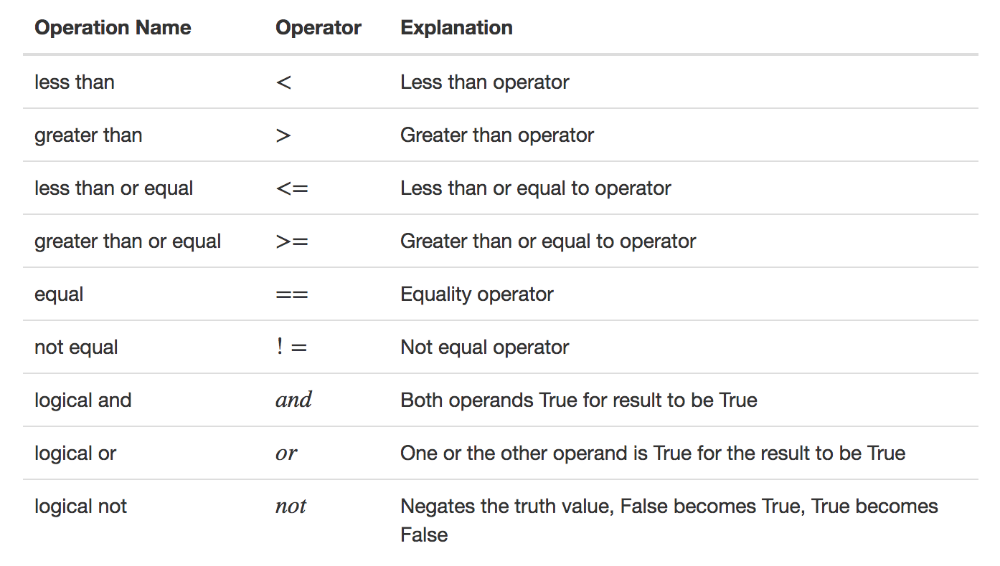
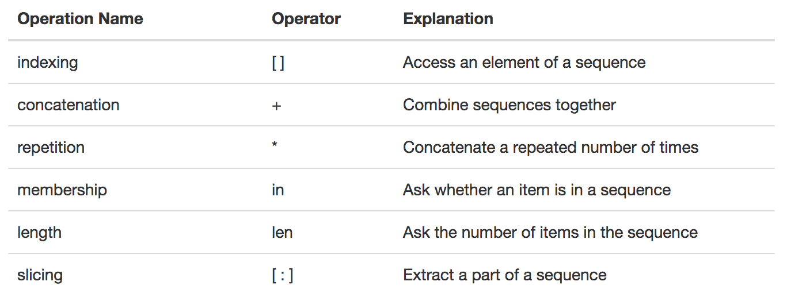
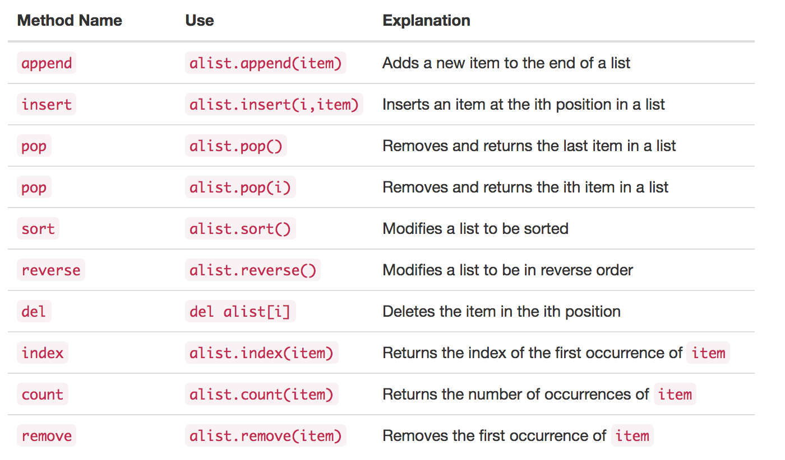
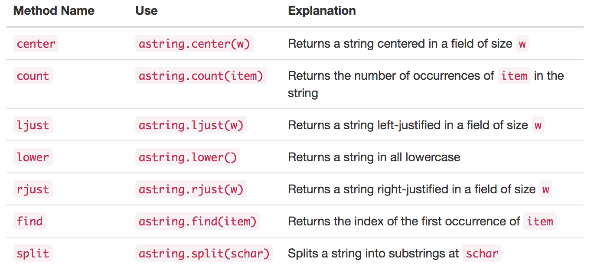

## 1.8 Getting Started with Data

### 1.8.1 Atomic Data Types

1. int
2. float
3. bool



### 1.8.2 Collection Data Types
#### list

```
>>> [1, 3, True, 6.5]
[1, 3, True, 6.5]
>>> myList = [1, 3, True, 6.5]
>>> myList
[1, 3, True, 6.5]

```
 



___
#### string

```
>>> "David"
'David'
>>> myName = "David"
>>> myName[3]
'i'
>>> myName*2
'DavidDavid'
>>> len(myName)
5
>>> myName.upper()
'DAVID'
>>> myName.center(10)
'  David   '
>>> myName.find('v')
2
>>> myName.split('v')
['Da', 'id']
```


